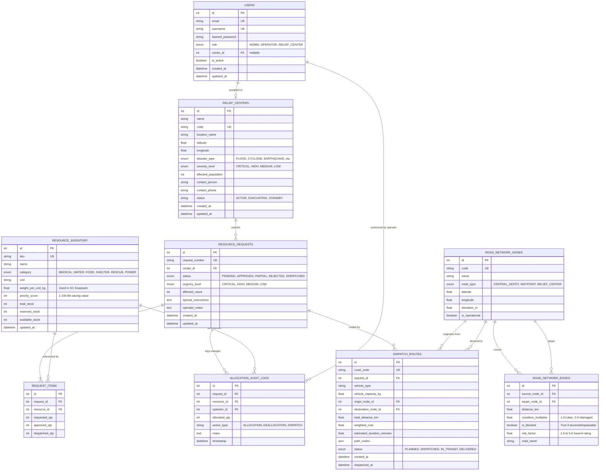

# RESQ-X: Database Entity-Relationship (ER) Document

```mermaid
erDiagram
    USERS ||--o| RELIEF_CENTERS : "assigned to"
    RELIEF_CENTERS ||--o{ RESOURCE_REQUESTS : "submits"
    RESOURCE_REQUESTS ||--|{ REQUEST_ITEMS : "contains"
    RESOURCE_INVENTORY ||--o{ REQUEST_ITEMS : "referenced by"
    RESOURCE_REQUESTS ||--o{ ALLOCATION_AUDIT_LOGS : "logs changes"
    RESOURCE_INVENTORY ||--o{ ALLOCATION_AUDIT_LOGS : "item tracked"
    USERS ||--o{ ALLOCATION_AUDIT_LOGS : "authorized by operator"
    RESOURCE_REQUESTS ||--o{ DISPATCH_ROUTES : "routed for"
    ROAD_NETWORK_NODES ||--o{ DISPATCH_ROUTES : "originates from"
    ROAD_NETWORK_NODES ||--o{ DISPATCH_ROUTES : "destined to"
    ROAD_NETWORK_NODES ||--o{ ROAD_NETWORK_EDGES : "source"
    ROAD_NETWORK_NODES ||--o{ ROAD_NETWORK_EDGES : "target"

    USERS {
        int id PK
        string email UK
        string username UK
        string hashed_password
        enum role "ADMIN, OPERATOR, RELIEF_CENTER"
        int center_id FK "nullable"
        boolean is_active
        datetime created_at
        datetime updated_at
    }

    RELIEF_CENTERS {
        int id PK
        string name
        string code UK
        string location_name
        float latitude
        float longitude
        enum disaster_type "FLOOD, CYCLONE, EARTHQUAKE, etc."
        enum severity_level "CRITICAL, HIGH, MEDIUM, LOW"
        int affected_population
        string contact_person
        string contact_phone
        string status "ACTIVE, EVACUATING, STANDBY"
        datetime created_at
        datetime updated_at
    }

    RESOURCE_INVENTORY {
        int id PK
        string sku UK
        string name
        enum category "MEDICAL, WATER, FOOD, SHELTER, RESCUE, POWER"
        string unit
        float weight_per_unit_kg "Used in 0/1 Knapsack"
        int priority_score "1-100 life-saving value"
        int total_stock
        int reserved_stock
        int available_stock
        datetime updated_at
    }

    RESOURCE_REQUESTS {
        int id PK
        string request_number UK
        int center_id FK
        enum status "PENDING, APPROVED, PARTIAL, REJECTED, DISPATCHED"
        enum urgency_level "CRITICAL, HIGH, MEDIUM, LOW"
        int affected_count
        text special_instructions
        text operator_notes
        datetime created_at
        datetime updated_at
    }

    REQUEST_ITEMS {
        int id PK
        int request_id FK
        int resource_id FK
        int requested_qty
        int approved_qty
        int dispatched_qty
    }

    ALLOCATION_AUDIT_LOGS {
        int id PK
        int request_id FK
        int resource_id FK
        int operator_id FK
        int allocated_qty
        string action_type "ALLOCATION, DEALLOCATION, DISPATCH"
        text notes
        datetime timestamp
    }

    ROAD_NETWORK_NODES {
        int id PK
        string code UK
        string name
        enum node_type "CENTRAL_DEPOT, WAYPOINT, RELIEF_CENTER"
        float latitude
        float longitude
        float elevation_m
        boolean is_operational
    }

    ROAD_NETWORK_EDGES {
        int id PK
        int source_node_id FK
        int target_node_id FK
        float distance_km
        float condition_multiplier "1.0=clear, 2.0=damaged"
        boolean is_blocked "True if severed/impassable"
        float risk_factor "1.0 to 5.0 hazard rating"
        string road_name
    }

    DISPATCH_ROUTES {
        int id PK
        string route_code UK
        int request_id FK
        string vehicle_type
        float vehicle_capacity_kg
        int origin_node_id FK
        int destination_node_id FK
        float total_distance_km
        float weighted_cost
        float estimated_duration_minutes
        json path_nodes
        enum status "PLANNED, DISPATCHED, IN_TRANSIT, DELIVERED"
        datetime created_at
        datetime dispatched_at
    }
```
